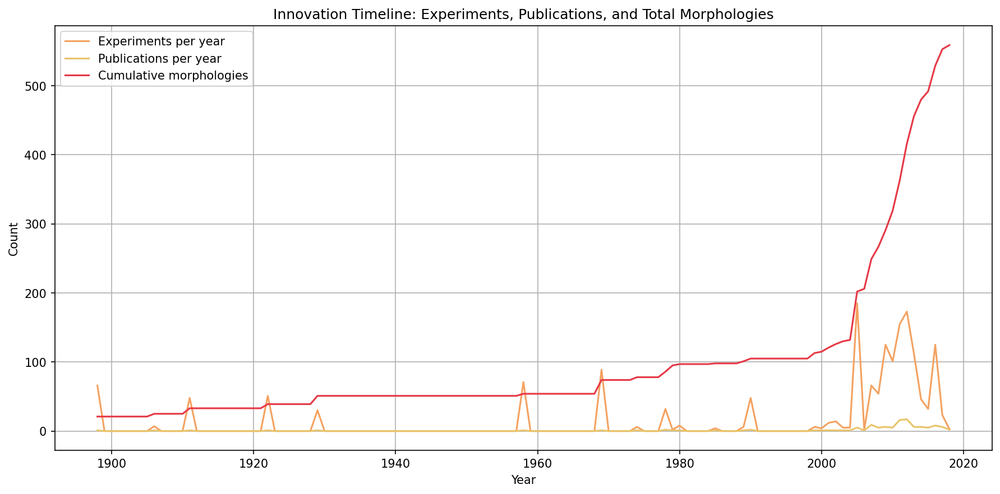

# Infinite Morphospace

This repository presents a chronological exploration of morphogenesis and theoretical biology, from early mathematical models to modern computational approaches. The scripts demonstrate key concepts in reaction-diffusion systems, procedural shape generation, and classic models from the field.

## Chronological Examples

### [1900-planformDB_parser.py](./1900-planformDB_parser.py)

Utilities to read a local PlanformDB SQLite/EDB file and extract yearly time series:
- Experiments per year (via `Experiment → Publication.Year`)
- Publications per year
- Distinct morphologies observed per year (frequency > 0)
- Morphology shape extraction and visualization

Produces a merged, gap-filled `pandas.DataFrame` and a quick `matplotlib` plot. Set `PLANFORM_DB_PATH` environment variable to your `.edb` file path and run the script to print summary rows and show the timeline.

The parser produces:
- Time series plot showing experiments, publications, and cumulative morphologies over time
- Animated GIF showing new morphologies documented each year, highlighted and superimposed on the wild-type planarian base

**References:**
- Lobo et al. (2011). Graph grammars with string-regulated rewriting. *Theoretical Computer Science* 412(45):6101-6111. [DOI](https://www.sciencedirect.com/science/article/pii/S0304397511005925)
- Lobo et al. (2013). Planform: an application and database of graph-encoded planarian regenerative experiments. *Bioinformatics* 29(8):1098-1100. [DOI](https://doi.org/10.1093/bioinformatics/btt088)

See [`datasets/planform/paper_citations.bib`](./datasets/planform/paper_citations.bib) for BibTeX citations.

### [thompson/1917-thompson.py](./thompson/1917-thompson.py)

A demonstration of D'Arcy Thompson's theory of transformations from *On Growth and Form* (1917), showing how one shape can be deformed into another through mathematical transformations. This classic work established the foundation for mathematical biology and the study of biological form.

Thompson-focused notes and dataset curation are in:
- [`thompson/DARCY_THOMPSON_FOCUSED_OPTIONS.md`](./thompson/DARCY_THOMPSON_FOCUSED_OPTIONS.md)
- [`thompson/MODERN_DATASETS_THOMPSON_ALIGNED.md`](./thompson/MODERN_DATASETS_THOMPSON_ALIGNED.md)

### [1952-turing-morpho.py](./1952-turing-morpho.py)

A simulation of the Gray-Scott reaction-diffusion model, implementing Alan Turing's groundbreaking theory from "The Chemical Basis of Morphogenesis" (1952). This model generates classic Turing patterns like spots and stripes, demonstrating how simple chemical reactions can produce complex biological patterns.

### [1966-raup.py](./1966-raup.py)

Implements David Raup's classic model of shell coiling from "Geometric Analysis of Shell Coiling" (1966). This parametric model generates a variety of 3D shell forms by controlling whorl expansion rate (W), distance from coiling axis (D), translation rate (T), and generating curve shape (S). The model demonstrates how three core parameters can generate the vast diversity of mollusk shell morphologies observed in nature.

Run `python create_raup_animations.py` to generate:
- Animated GIF showing shells morphing through parameter space
- Parameter space visualization exploring W, D, and T
- Comparison with empirical shell forms (Nautilus, Turritella, Ammonite, etc.)

### [2021-Cervera–Levin–Mafe.py](./2021-Cervera–Levin–Mafe.py)

A reaction-diffusion demo inspired by Cervera–Levin–Mafe (2021), exploring morphogen antagonism and its effect on pattern formation. The model includes:
- Antagonistic morphogens (m1, m2) on an antero-posterior axis with mutual annihilation
- Independent morphogen (m3) on a lateral axis
- Gap-junction blocking effects modeled through diffusion reduction
- 3D morphospace visualization of mean expressions

## Analysis Tools

### [Ca²⁺ Wave Vector Analysis](./wave-vector-analysis/)

A complete pipeline for detecting and tracking Ca²⁺ signaling waves in time-lapse microscopy images of embryos. Processes multi-page TIFF images to detect bright spark events, track them across frames, segment embryos, and generate comprehensive analysis outputs. Includes visualization tools and supports 16-bit scientific imaging data.

**See [`wave-vector-analysis/README.md`](./wave-vector-analysis/README.md) for full documentation.**

#### Visualization Example

Flow field visualization showing spatial vector fields of Ca²⁺ wave propagation:

*Spatial vector field showing wave propagation directions and speeds. This visualization complements standard analysis tools by providing spatial flow patterns not available in direction distribution plots.*

### [Nanopublications](./nanopubs/)

Nanopublication-related files including wave files (.trig format), hypothesis mappings, and scripts for processing and canonicalizing nanopublications. These tools enable structured representation and sharing of scientific findings in a machine-readable format.

**See [`nanopubs/README.md`](./nanopubs/README.md) for details.**
